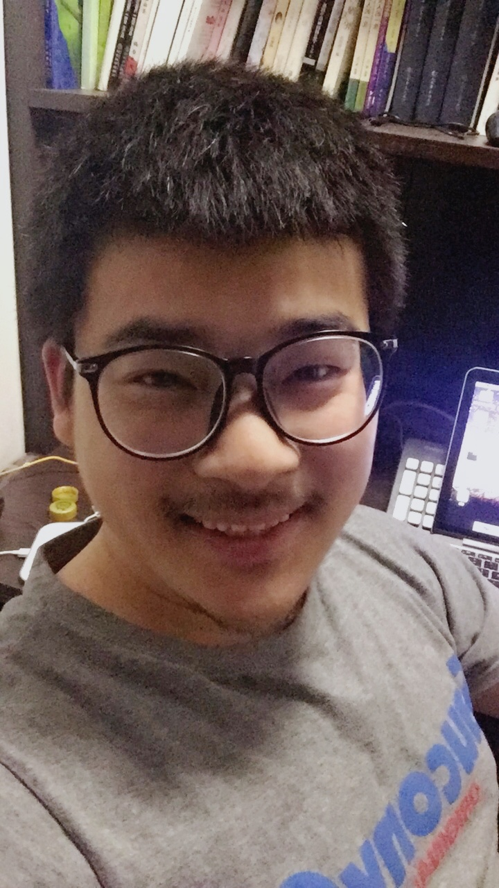

* content
{:toc}

## 关于我

就职于澳洲软件公司Fabricgroup 主要从事java项目的开发和技术支持

凡是和互联网有关的技术我都感兴趣,前后端开发的分离趋势,让我这样一个一直藏在后端的人有机会接触和实施前端的技术,自从国内有了全栈工程师的概念,我就狂奔在这条路上，裤衩都已经跟不上我的速度.

兴趣广泛,爱玩游戏也爱学习.

* 2015-06		参与澳洲[TOYOTA ](http://www.toyota.com.au/) 手机项目的开发
>*Ionic前端 Java服务端 Azure服务器 MuleESB通信总线 .Net web前端 etc.一句话有钱的公司花样多.*
* 2015-04		参与澳洲最大百货[MYER ](http://myer.com.au/) 的系统整合
>*初识Salesforce, MuleESB,负责数据通信.*
* 2014-07		参与澳洲公司[Zero Agency ](http://agencyzero.com/) 的产品开发和升级
>*JSP与H5的结合,后台是传统不能再传统的Servlet(JSP),你敢信!*
* 2014-05		就职于澳洲公司Fabricgroup, 做一名SE Dev-Ops
>*放飞吧，我那向往自由的心.*
* 2013-10		升职加薪走向人生大坑
>*一周三次会,次次在凌晨.有事打电话没事接电话.*
* 2013-03		在大连花旗做技术框架升级
>*重构Struts2框架,整合spring workflow,开发自动化部署和自动化测试报表工具.*
* 2012-10		在大连花旗做贷款系统业务
* 2011-10		在大连花旗做信用卡系统业务
>*银行内部系统,在struts1的基础上重构实现了struts2的功能.还是蛮神奇的.*
* 2010-12		在大连松下做ERP系统升级
>*非常无聊的系统.初识C#并深深的被Oracle存储过程伤害了. :cry:*
* 2010-10 	在IBM做数据挖掘报表
>*对大量EXCEL文件数据进行识别和计算并生成报表.初识VB, python.*
* 2008-08 	开始欧美业务之旅,在GE部门做银行CRM项目
>*大学毕业以为告别了英语,万万没想到又一个轮回.初识SSH, workflow, oracle.*
* 2008-04 	在大连华信软件公司电子商务部门做社保项目
>*初识Java ,Struts1 .国内的项目做起来真的能让人飞 .*
* 2007-06 	在苏州一家台湾电子企业做PLC自动化编程
>*从没想过第一份工作竟然用的是选修课的学到的技术,更没想到的是PLC这门选修课我还是补考过的.步入社会,很神奇也很迷茫啊.*

## 联系我

* GitHub：[sunnyroc](https://github.com/sunnyroc)
* Email: bien.sun@hotmail.com
* Office:	roc.sun@fabricgroup.com.au

## Comments


